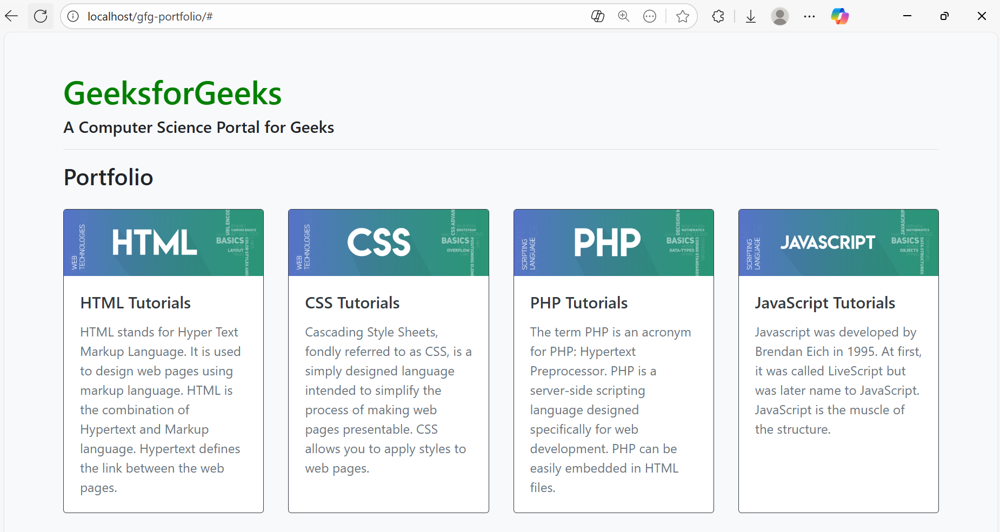

# Week 4 Assignment – CSS Practice

## 📌 Project Overview

This week’s assignment was focused on **learning and applying CSS** to style a simple HTML portfolio page.
I built a responsive portfolio layout using **HTML, CSS, and Bootstrap** to practice styling, spacing, typography, and layout structure.

👉 You can access my code here: [index.html](./index.html) and [style.css](./style.css).

## 🎯 Objectives

* Understand how CSS works with HTML elements.
* Practice using Bootstrap classes and custom CSS.
* Experiment with typography, colors, and spacing.
* Create a clean and responsive portfolio page.

## 🛠️ Technologies Used

* **HTML5** – for structuring the content.
* **CSS3** – for styling and layout customization.
* **Laragon** – as the local development environment to run and test the project.

## 🚀 Features

* A styled **header section** with custom colors.
* A **portfolio section** with cards for HTML, CSS, PHP, and JavaScript tutorials.
* Responsive layout that adapts to different screen sizes.
* Customized typography (e.g., `h1` styled with green color).

## 📸 Screenshots

Here’s how the project looks in the browser:

## 📚 Lessons Learned

* Importance of using `margin` and `padding` for spacing.
* How colors and typography affect readability.
* Practiced debugging CSS when styles didn’t apply correctly.