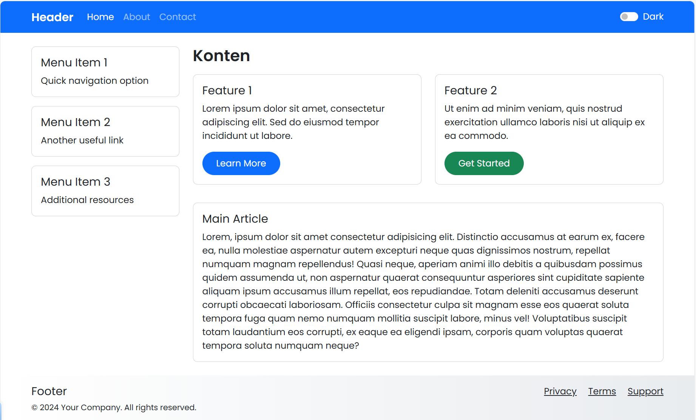

# Week 6 Assignment – Building A Responsive Webpage Layout  
**Author:** Bara Semangat Rohmani (SID 5025241144)

 

## 📌 Project Overview

This week’s assignment focused on **building and styling a responsive webpage layout** using **Bootstrap 5, custom CSS, and JavaScript**. I worked step by step to create a structured page with a header, sidebar, main content area, and footer. Along the way, I experimented with Bootstrap’s grid system, responsive navigation, dark mode toggling, and custom styling to deepen my understanding of web programming.

👉 The final code is implemented in **Laragon** as my local development environment, and the main file is [`index.html`](/week-6/index.html).

---

 

## 🎯 Objectives

* Learn how to structure a webpage using **Bootstrap’s grid system**.  
* Practice creating a **sidebar + content layout** with responsive behavior.  
* Apply **custom CSS** for typography, hover effects, gradients, and rounded buttons.  
* Implement **interactive features** with Bootstrap JS (collapse, navbar toggle, dark mode).  
* Debug and refine layout issues (e.g., card styling, navbar alignment on small screens).  

---

 

## 🛠️ Technologies Used

* **HTML5** – for semantic structure.  
* **Bootstrap 5.3** – for responsive layout, navbar, grid, and components.  
* **CSS3** – for custom styling (gradients, hover effects, typography).  
* **JavaScript** – for dark mode toggle and localStorage persistence.  
* **Laragon** – as the local development server.  

---

 

## 🚀 Features Implemented

* **Header with responsive navbar**  
  - Navigation links (*Home, About, Contact*) collapse into a hamburger menu on small screens.  
  - Dark mode toggle switch placed on the far right of the navbar.  

* **Sidebar with cards**  
  - Three menu items displayed as Bootstrap cards.  
  - Collapsible sidebar for mobile view.  

* **Main content area**  
  - Two feature cards with buttons (*Learn More* and *Get Started*).  
  - A **Main Article** card with longer text content.  

* **Footer**  
  - Gradient background using Bootstrap variables.  
  - Links for Privacy, Terms, and Support.  

* **Dark Mode Toggle**  
  - Implemented using `data-bs-theme` attribute.  
  - User preference stored in `localStorage`.  
  - Cards and text use `bg-body` and `text-body` so they adapt automatically.  

* **Custom CSS Enhancements**  
  - Gradient header and footer.  
  - Rounded buttons with extra padding.  
  - Hover effect on cards (lift + shadow).  
  - Google Fonts integration (`Poppins`).  

---

 

## 📚 Lessons Learned

* **Bootstrap Grid & Layout** – how to divide the page into sidebar and main content using `row` and `col-md-*`.  
* **Responsive Navbar** – using `navbar-expand-md` and `navbar-toggler` to handle small screen layouts.  
* **Dark Mode Implementation** – learned to use `data-bs-theme` and avoid hardcoded `bg-dark`/`bg-light` classes by switching to `bg-body` and `text-body`.  
* **Custom Styling** – applied gradients, hover effects, and typography to make the layout more engaging.  
* **Debugging Process** – fixed issues such as:  
  - Navbar links misaligned on small screens.  
  - Dark mode not applying correctly due to hardcoded classes.  
  - Main Article card height inconsistency.  

---

 

## 📸 Screenshots

### 1. Light Mode View
  
This shows the page in **light mode**, where the background and text colors follow Bootstrap’s `bg-body` and `text-body`.

### 2. Dark Mode View
  
After toggling dark mode, the theme switches to `data-bs-theme="dark"`. Cards and text adapt automatically.

### 3. Responsive Navbar (Desktop)
  
On larger screens, the navigation links (*Home, About, Contact*) are aligned left, with the dark mode toggle on the right.

### 4. Responsive Navbar (Mobile)
  
On smaller screens, the navbar collapses into a hamburger menu, ensuring a clean and mobile-friendly layout.

### 5. Sidebar Collapse
  
The sidebar can be toggled on mobile devices using the **Toggle Menu** button.

### 6. Hover Effect on Cards
  
Cards lift slightly and cast a shadow when hovered, improving interactivity.

### 7. Main Article Section
  
The main article card displays longer text content.

---

 

## 📝 Reflection

This week’s work helped me connect **theory with practice**. I didn’t just copy Bootstrap components but also learned how to **customize and debug them**. The process of asking questions, trying modifications, and fixing issues (like dark mode and responsive navbar) showed me how web development is iterative. Each step improved my understanding of how **HTML, CSS, Bootstrap, and JavaScript** interact to create a polished, responsive webpage.