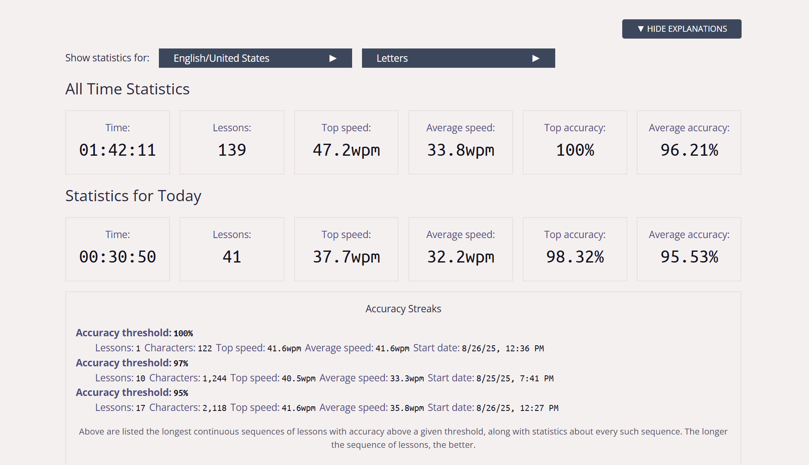

# Week 1 — Touch Typing (10-Finger) Practice

**Overview**
This week’s assignment asked me to document a simple, personal skill: learning to type using the 10-finger (touch typing) method without looking at the keyboard. I chose this topic both because it’s practical for web development and because it reflects a real learning challenge I’ve been facing.

**Background**
I have known the concept of 10-finger typing for a long time and have used speed-testing sites like *monkeytype.com* before. Despite that, my 10-finger technique had not become second nature — for over a year my speed was stagnant, staying below 15 WPM. I also struggled typing in low-light conditions: without seeing the keys I would often be completely lost.

This felt embarrassing among classmates who type quickly, but I wanted to be sure: is 10-finger typing the right approach for me, or should I stick to the hybrid method I already use that feels faster?

**What I tried**
I decided to try a different training approach. I started practicing with *keybr.com* for four consecutive days, 30 minutes per day. Keybr emphasizes a gradual, structured progression: it introduces a small set of letters first, drills them until patterns are comfortable, and then adds more characters step by step.

**Results & Reflection**
After four days of focused, incremental practice, I noticed a real improvement. My speed, which had been under 15 WPM, became consistently around **20 WPM** (and sometimes higher). That change convinced me that the problem wasn’t my willingness to use all ten fingers or the number of practice hours — it was the *learning method*. The staged approach (learning a few characters at a time, building muscle memory) suits me and produces steady gains.

**Conclusion & Next steps**
I will continue this structured practice schedule and document each session in this repository. My short-term goal is to reach reliable 40–50 WPM without looking at the keyboard. Long term, I want touch typing to be an unconscious habit so I can focus on coding and thinking instead of where my fingers are.

---

# Attachments (Photos)

```markdown

My practice environment, showing the low-light condition I train in.


*Figure 2 — Keybr session summary on Day 4 (example).*
```