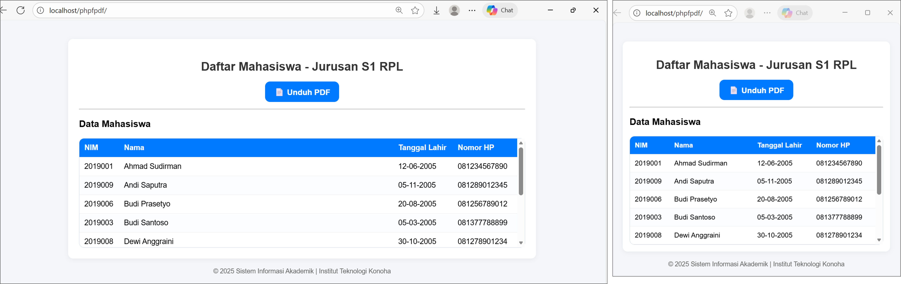
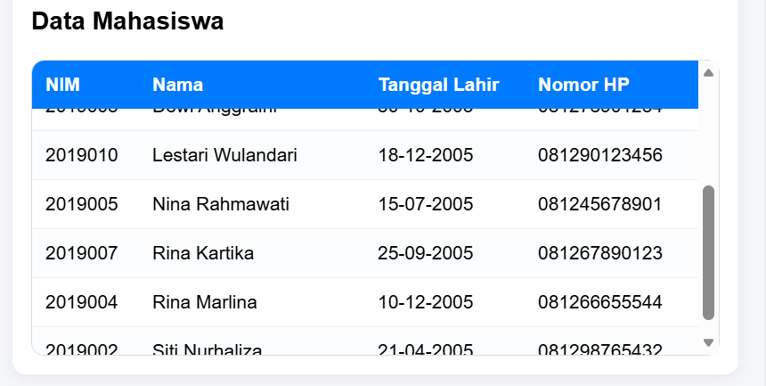
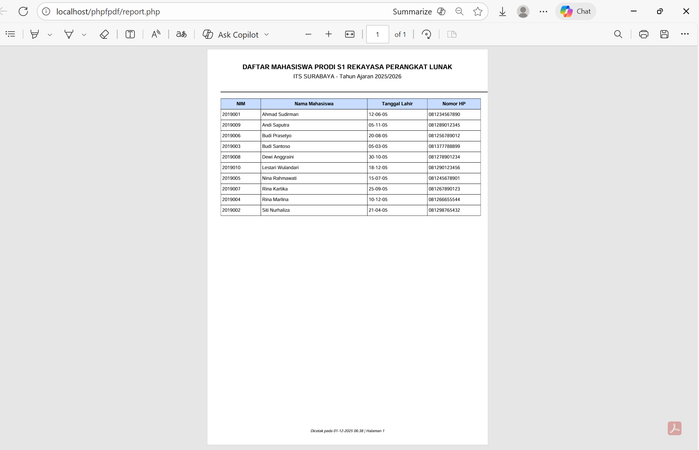

# Week 15 Assignment – PDF Report Generator for Student Roster
**Author:** Bara Semangat Rohmani (SID 5025241144)

 

## 📌 Project Overview

This week's assignment focused on building a simple web interface to view student data and **generate a printable PDF roster** using **PHP**, **MySQL**, and **FPDF**. The frontend is styled with custom CSS (no frameworks) and includes a responsive layout, a sticky table header, and a scrollable table area. The PDF report is generated on-the-fly from the same database and uses FPDF to create a neat, printable document (portrait A4).

👉 The final code can be accessed [here](/week-15/phpfpdf/).

---

 

## 🎯 Objectives

* Implement a PHP + MySQL CRUD-ish view for student records.
* Create a user-friendly, responsive HTML/CSS interface to display data.
* Add a button to generate a PDF roster using FPDF.
* Keep the UI compact by limiting visible table rows to five (scrollable area) while preserving accessibility and printability.

---

 

## 🛠️ Technologies Used

* PHP 7.x/8.x
* MySQL
* FPDF (PHP library) - for PDF generation
* HTML5, CSS3 (vanilla)
* Laragon 

---

 

## 🚀 Features Implemented

* PDF generation using FPDF
* Friendly download button with `target="_blank"` to open PDF in a new tab
* Responsive page wrapper with clean card-like container
* Scrollable table container that shows at most ~5 rows (via CSS)
* Zebra rows & hover highlight for readability

---

 

## 📚 How to Run (Local)

1. Place project files (`fpdf.php`, `connection.php`, `report.php`, `index.php`) into webroot (`htdocs` for XAMPP, `www` for Laragon).
2. Ensure MySQL and Apache are running.
3. Create the DB and table using the SQL.
4. Open `http://localhost/<project-folder>/` in browser.

Click the **Unduh PDF** button to open/download the PDF.

---

 

## 📸 Screenshots

### 1. Main UI (light mode)
  

### 2. Table showing scroll behavior
  

### 3. Generated PDF preview
  

---

 

## 📝 Reflection

This week’s work helped me understand how the frontend and backend work together, especially when **displaying data cleanly and generating a PDF report**. I learned how small UI details can make the page feel more user-friendly. Overall, this was a good hands-on experience that strengthened my confidence in building simple but effective web applications.

 

## ✅ Licence

This project is provided for learning purposes. Feel free to reuse or adapt the code for personal projects.
