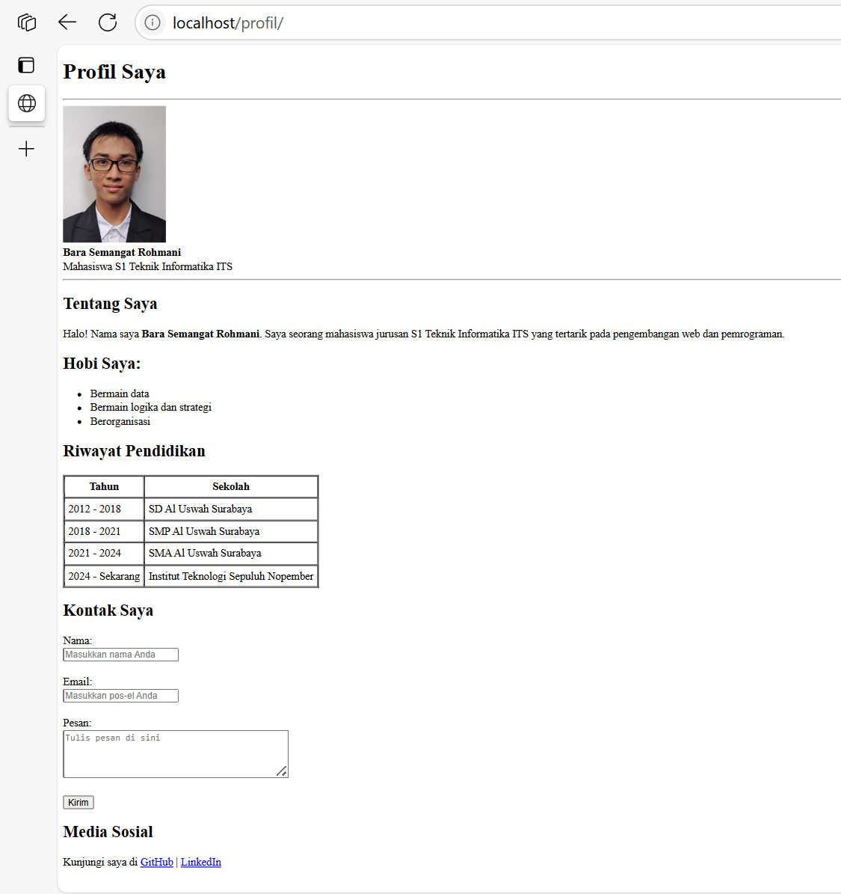

# Week 2 — Simple Profile Page



## Source Code
```
<!DOCTYPE html>
<html>
<head>
    <title>Profil Bara S. Rohmani</title>
</head>
<body>
    <!-- Heading -->
    <h1>Profil Saya</h1>
    <hr>

    <!-- Foto Profil + Nama -->
    <br>
    <b>Bara Semangat Rohmani</b><br>
    Mahasiswa S1 Teknik Informatika ITS
    <hr>

    <!-- Paragraf Deskripsi -->
    <h2>Tentang Saya</h2>
    <p>Halo! Nama saya <b>Bara Semangat Rohmani</b>.
    Saya seorang mahasiswa jurusan S1 Teknik Informatika ITS
    yang tertarik pada pengembangan web dan pemrograman.</p>

    <!-- Daftar Hobi -->
    <h2>Hobi Saya</h2>
    <ul>
        <li>Bermain data</li>
        <li>Bermain logika dan strategi</li>
        <li>Berorganisasi</li>
    </ul>

    <!-- Tabel Pendidikan -->
    <h2>Riwayat Pendidikan</h2>
    <table border="1" cellpadding="5" cellspacing="0">
        <tr>
            <th>Tahun</th>
            <th>Sekolah</th>
        </tr>
        <tr>
            <td>2012 - 2018</td>
            <td>SD Al Uswah Surabaya</td>
        </tr>
        <tr>
            <td>2018 - 2021</td>
            <td>SMP Al Uswah Surabaya</td>
        </tr>
        <tr>
            <td>2021 - 2024</td>
            <td>SMA Al Uswah Surabaya</td>
        </tr>
        <tr>
            <td>2024 - Sekarang</td>
            <td>Institut Teknologi Sepuluh Nopember</td>
        </tr>
    </table>

    <!-- Form Kontak -->
    <h2>Kontak Saya</h2>
    <form>
        <label>Nama:</label><br>
        <input type="text" name="nama" placeholder="Masukkan nama Anda"><br><br>

        <label>Email:</label><br>
        <input type="email" name="email" placeholder="Masukkan pos-el Anda"><br><br>

        <label>Pesan:</label><br>
        <textarea name="pesan" rows="4" cols="40" placeholder="Tulis pesan di sini"></textarea><br><br>

        <input type="submit" value="Kirim">
    </form>

    <!-- Link Media Sosial -->
    <h2>Media Sosial</h2>
    <p>
        Kunjungi saya di 
        <a href="https://github.com/betasygma" target="_blank">GitHub</a> |
        <a href="https://linkedin.com/in/bararohmani" target="_blank">LinkedIn</a>
        </p>

</body>
</html>
```