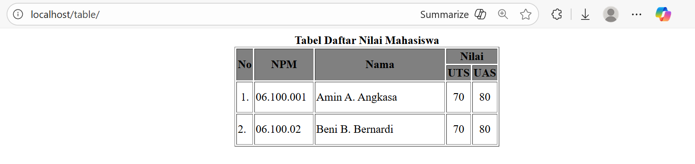
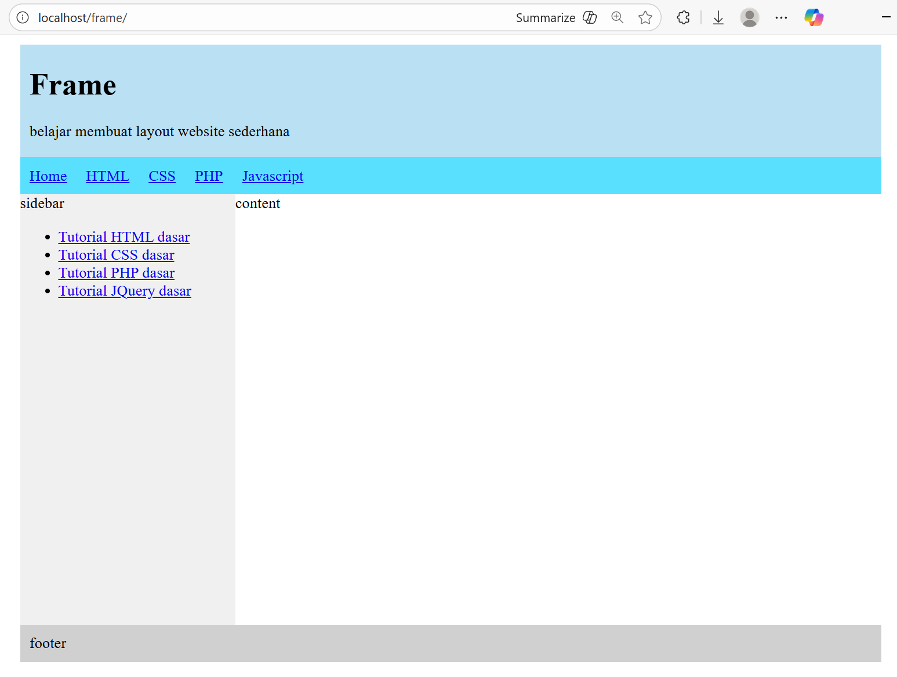

  
# Week 3 — Table, Form, and Frame

## **Table**


## Source Code

```html
<!DOCTYPE html>
<html>
<head>
    <title>Create Table</title>
</head>
<body>
    <table border="1" bgcolor="white" align="center">
        <caption align="top">
            <b>Tabel Daftar Nilai Mahasiswa</b>
        </caption>
        <tr bgcolor="gray">
            <th rowspan="2">No</th>
            <th rowspan="2">NPM</th>
            <th rowspan="2">Nama</th>
            <th colspan="2">Nilai</th>
        </tr>
        <tr bgcolor="gray">
            <th>UTS</th>
            <th>UAS</th>
        </tr>
        <tr>
            <td align="center" width="20">1.</td>
            <td align="left" valign="middle" width="80" height="40">06.100.001</td>
            <td align="left" valign="middle" width="180" height="40">Amin A. Angkasa</td>
            <td align="center" valign="middle">70</td>
            <td align="center" valign="middle">80</td>
        </tr>
        <tr>
            <td width="20">2.</td>
            <td align="left" valign="middle" width="80" height="40">06.100.02</td>
            <td align="left" valign="middle" width="180" height="40">Beni B. Bernardi</td>
            <td align="center" valign="middle">70</td>
            <td align="center" valign="middle">80</td>
        </tr>
    </table>
</body>
</html>
```

<br><br>

## **2. Form**


## Source Code

```html
<!DOCTYPE html>
<html>

<head>
    <meta charset="UTF-8" />
    <meta name="viewport" content="width=device-width, initial-scale=1.0" />
    <title>HTML Registration Form</title>
    <style>
        body {
            font-family: Helvetica, sans-serif;
            margin: 0;
            padding: 0;
            display: flex;
            justify-content: center;
            align-items: center;
            height: 100vh;
        }

        .main {
            background-color: #fff;
            border-radius: 25px;
            box-shadow: 0 0 20px rgba(0,0,0,0.1);
            padding: 20px;
            width: 400px;
        }

        .main h2 {
            color: #4caf4c;
            margin-bottom: 20px;
        }

        label {
            display: block;
            margin-bottom: 5px; 
            color: #555;
            font-weight: bold;
        }

        input[type="text"],
        input[type="email"],
        input[type="password"],
        select {
            width: 100%;
            margin-bottom: 15px;
            padding: 10px;
            box-sizing: border-box;
            border: 1px solid #ddd;
            border-radius: 15px;
        }

        button[type="submit"] {
            padding: 15px;
            border-radius: 20px;
            border: none;
            background-color: #4caf4c;
            color: white;
            cursor: pointer;
            width: 100%;
            font-size: 16px;
        }
    </style>
</head>

<body>
    <div class="main">
        <h2>Registration Form</h2>
        <form action="">
            <label for="first">First Name:</label>
            <input type="text" id="first" name="first" required />

            <label for="last">Last Name:</label>
            <input type="text" id="last" name="last" required /> 

            <label for="email">Email:</label>
            <input type="email" id="email" name="email" required /> 

            <label for="password">Password:</label>
            <input type="password" id="password" name="password" 
            pattern="^(?=.*\d)(?=.*[a-zA-Z])(?=.*[^a-zA-Z0-9])\S{8,}$" 
            title="Password must contain at least one number, one alphabet, one symbol, and be at least 8 characters long"
            required /> 

            <label for="repassword">Re-type Paswword:</label>
            <input type="password" id="repassword" name="repassword" required /> 

            <label for="mobile">Contact:</label>
            <input type="text" id="mobile" name="mobile" maxlength="20" required /> 

            <label for="gender">Gender:</label>
            <select id="gender" name="gender" required>
                <option value="male">Male</option>
                <option value="female">Female</option>
                <option value="other">Other</option>
            </select>

            <button type="submit">Submit</button>
        </form>
    </div>
</body>

</html>
```

<br><br>

## **3. Frame**


## Source Code

```html
<!DOCTYPE html>
<html>

<head>
    <title>Simple Frame</title>
    <link rel="stylesheet" type="text/css" href="style.css">
</head>

<body>
	<div class="wrap">
		<div class="header">			
			<h1>Frame</h1>
			<p>belajar membuat layout website sederhana</p>
		</div>
		<div class="menu">
			<ul>
				<li><a href="#">Home</a></li>
				<li><a href="#">HTML</a></li>
				<li><a href="#">CSS</a></li>
				<li><a href="#">PHP</a></li>
				<li><a href="#">Javascript</a></li>				
			</ul>
		</div>
		<div class="badan">			
			<div class="sidebar">
				sidebar
				<ul>
					<li><a href="#">Tutorial HTML dasar</a></li>
					<li><a href="#">Tutorial CSS dasar</a></li>
					<li><a href="#">Tutorial PHP dasar</a></li>
					<li><a href="#">Tutorial JQuery dasar</a></li>				
				</ul>
			</div>
			<div class="content">
				content
			</div>
		</div>
		<div class="clear"></div>
		<div class="footer">
			footer
		</div>
	</div>
</body>

</html>
```
